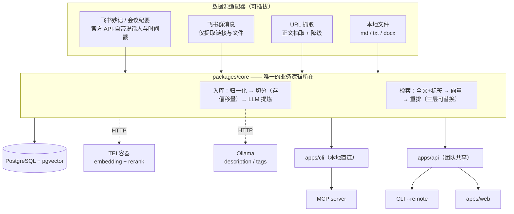

# ADR-001 技术栈与分层架构

> Created: 2026-08-21
> Updated: 2026-08-21
> Status: accepted
>
> **本文是本仓库第一份拍板文档。** 在此之前 `AGENTS.md` 与 `working-direction.md` 均声明「技术栈未定」，本文解除该状态。
>
> 决策人：项目负责人（产品视角）· 记录人：AI 协作代理 · 决策会话日期 2026-08-21
>
> 上游方向草案：[working-direction.md](./working-direction.md)。本文只决定**怎么实现**，不改变产品目标；唯一改变产品边界的是第 8 节（语料边界），已同步回草案 §6。

---

## 1. 问题陈述

仓库此前只有文档骨架，零源码。`working-direction.md` §9 列出七项「尚未拍板」，导致任何编码工作都无法开始——包括 AI 代理，因为 `AGENTS.md` 明确禁止代理擅自选定语言、框架与部署平台。

同时，项目即将进入 **issue 驱动的无人值守长程开发**（见 [plan-loop-engineering.md](../plans/plan-loop-engineering.md)）。无人值守的前提是所有执行者（人与 AI）共享同一份架构事实，否则半夜的每个 sub-agent 都会各自猜测架构，产出互相冲突的代码。

**本文要解决的就是这件事：把架构从「待决策」变成「可被机械遵循的约束」。**

---

## 2. 决策摘要

| # | 维度 | 决策 | 主要理由 |
|---|---|---|---|
| D1 | 语言 / 运行时 | TypeScript + Node.js（strict） | CLI 与 Web 同栈，类型跨端共享 |
| D2 | 仓库形态 | pnpm workspace monorepo | 检索核心必须被 CLI / API / MCP 三处复用 |
| D3 | 数据库 | PostgreSQL + pgvector，Docker 本地 | 关系数据、全文检索、向量索引一库解决 |
| D4 | 中文分词 | 应用层 `Intl.Segmenter`，不装 zhparser | 避免自建 Postgres 镜像 |
| D5 | 向量 / 重排 | TEI 容器，HTTP 调用 | 本地模型但不进 Node 进程；数据不出本机 |
| D6 | 提炼 LLM | 本地 Ollama，provider 可插拔 | 数据不出本机；受控任务小模型够用 |
| D7 | 检索策略 | 三层递进，接口可替换 | 全文兜底永不失效；向量与重排是增强 |
| D8 | 读写路径 | LLM 只在写路径；读路径确定性 | 检索可测、零成本、可复现 |
| D9 | 门面 | CLI / MCP / HTTP API 三门面平权 | 非技术同事需要远程模式 |
| D10 | 语料边界 | 飞书妙记 + 群内链接文件；**不含发言原文** | 官方授权通道，且规避同事隐私 |

---

## 3. 逐项决策与方案对比

### D1 语言 / 运行时：TypeScript + Node.js

| 方案 | 优势 | 劣势 | 结论 |
|---|---|---|---|
| **TypeScript 全栈** | CLI 与 Web 同栈；类型可跨端共享；分发成熟 | 进程内跑 ML 模型是弱项 | **采用**（劣势由 D5 消解） |
| Python 全栈 | RAG / ML / 转写生态最强 | Web UI 仍需另一套栈；类型跨语言只能靠 OpenAPI | 否决 |
| Python 后端 + TS 前端 | 能力最强 | 两套工具链与依赖体系，单人维护成本过高 | 否决 |

TypeScript 唯一的真实短板是「本地跑 embedding / rerank 模型」。该短板已由 D5 用独立容器消解，因此不构成否决理由。

**约束**：`strict: true`。禁止 `any` 逃生舱——用 `unknown` + 类型收窄（`AGENTS.md` Critical Rules 已有此条）。

### D2 仓库形态：pnpm workspace monorepo

决定性依据是一条产品要求：**非技术同事也要能用 CLI**。

该要求与「CLI 直连本地 Docker 数据库」直接冲突——非技术同事不可能在自己机器上装 Docker、起 Postgres、起 TEI、再灌一份语料。因此必须存在一个共享的远程服务，CLI 需要同时支持本地直连与远程调用两种模式。

推论：**检索与入库逻辑必须被 CLI 和 API 同时复用**，这就要求核心逻辑独立成包。

```
packages/core/     入库、检索、数据访问 —— 唯一的业务逻辑所在
apps/cli/          命令行门面
apps/api/          HTTP 门面（团队共享服务、Web 的后端）
apps/web/          Web UI
```

**这是本 ADR 最重要的一条纪律，违反它的代价是整体重写：**

> 任何业务逻辑都不得写在 CLI 的命令处理函数、或 API 的路由处理函数里。
> CLI、API、MCP 都只是 `packages/core` 的**薄门面**——负责解析入参、调用 core、格式化输出，不含决策逻辑。

判断标准：把 `apps/cli` 整个删掉，`packages/core` 的测试应该全部照常通过。

### D3 数据库：PostgreSQL + pgvector

单一 Postgres 同时承担关系数据、全文检索、向量索引三件事，避免引入独立向量库（Qdrant / Milvus）带来的第二个数据源与一致性问题。以本项目的语料规模（数 MB 文本），专用向量库的性能优势完全不可感知。

镜像用官方 `pgvector/pgvector`，**不自建**（见 D4）。本地通过 `docker compose` 启动。

### D4 中文分词：应用层 `Intl.Segmenter`

Postgres 原生不切中文词，常规做法是编译 `zhparser` 或 `pg_bigm` 进镜像。

| 方案 | 劣势 | 结论 |
|---|---|---|
| zhparser / pg_bigm | 必须自建 Postgres 镜像：构建慢、跨平台易碎、**无人值守时挂掉难诊断** | 否决 |
| `nodejieba` | 原生模块，Windows 编译常有坑 | 否决 |
| **Node 内置 `Intl.Segmenter`** | 需自行维护停用词等细节 | **采用** |

Node 24 内置的 `Intl.Segmenter`（`granularity: 'word'`）支持中文分词，零依赖、跨平台。在应用层分词后写入 `tsvector`（Postgres 端用 `simple` 配置），Postgres 镜像因此保持原厂状态。

代价是分词质量不如专业词典分词。可接受，因为全文检索在 D7 中的角色是**兜底**，精度由向量层和重排层负责。

### D5 向量 / 重排：TEI 容器

产品要求「模型跑在本地，数据不出本机」，但 D1 选了 TypeScript。

| 方案 | 问题 | 结论 |
|---|---|---|
| Node 进程内跑（transformers.js + ONNX） | 慢；模型转换有坑；rerank 支持不成熟 | 否决 |
| Ollama 提供 embedding | **Ollama 不支持 rerank**，无法满足重排需求 | 否决 |
| **TEI 独立容器** | 多一个容器 | **采用** |

HuggingFace Text Embeddings Inference 同时提供 OpenAI 兼容的 `/v1/embeddings` 与 `/rerank` 两个 HTTP 端点。TypeScript 侧只是 HTTP 客户端。三个目标同时达成：模型在本地、数据不出本机、Node 里没有模型代码。附带收益是将来想换云 API 只需改 base URL。

**镜像选择（重要）**：本机显卡为 RTX 5060 Laptop（Blackwell 12.0, 8GB）。TEI 对 GeForce 50 系的镜像是 `120-1.9`，官方标注 **experimental**。

> 默认使用 CPU 镜像。GPU 镜像作为 compose 的**可选 profile**，且必须人工验证可用后才允许启用。
> 理由：无人值守场景下 experimental 镜像启动失败会浪费整段时间窗，而本项目语料规模下 CPU 灌向量是分钟级操作，并非瓶颈。

### D6 提炼 LLM：本地 Ollama，provider 可插拔

入库时需要 LLM 生成 `description` 与 `tags`。选择本地 Ollama 以保证数据不出本机。

**已知局限与对策**：8GB 显存能装下的模型（7-8B 级）写自由创作类中文摘要质量有限。对策是**把任务设计成受限任务**——不让模型自由发挥，而是「读这段正文 → 写一句话摘要 → 从下面这 N 个已有标签里选 3 个」。受控词表（见 D7 的 tags 设计）恰好把小模型的弱点规避掉了，这是两个决策的协同效应，不是巧合。

选定模型：`qwen3:8b`（能完整装入显存、中文能力足够、遵循结构化输出指令）。**不使用** `deepseek-r1:8b`——推理模型做结构化抽取是错配，会输出大段思考过程且格式不稳。

**约束**：LLM 调用必须走 provider 接口（`OllamaProvider` 为默认实现），换云 API 只改配置不改代码。

**运维前提**：Ollama 服务在 Windows 上按需启动。任何依赖提炼的自动化流程**必须先做健康检查**，否则会静默失败。

### D7 检索策略：三层递进，接口可替换

```
Stage 1  全文检索 + 标签过滤        永远可用的兜底，无任何模型依赖
Stage 2  向量检索（pgvector）        语义相近但用词不同的召回
Stage 3  重排（TEI /rerank）         排序质量
```

三层通过同一个检索接口对外，返回同一个结果结构。**Stage 1 不会被后续阶段替代**，它是「无模型时关键词 + 标签检索仍须可用」这条产品硬要求（草案 §6.2）的实现。

**评测集是 Stage 1 的交付物，不是 Stage 2 的。** 一组「真实提问 → 期望命中文档」的样例是判断「加了向量到底变好还是变坏」的唯一手段。没有它，后续所有检索优化都只能靠感觉，无法验收。

**tags 采用受控词表**：LLM 只能从现有词表中选择；它认为需要新词时写入待确认表，由人工或批量确认后才进正式词表。理由是自由生成会产生 `RAG` / `检索增强` / `retrieval` 这类同义标签泛滥，三个月后标签筛选失效——而标签筛选正是渐进式披露的入口。

### D8 读写路径分离：LLM 只出现在写路径

这是整个系统的组织原则。

| | 写路径（入库） | 读路径（检索） |
|---|---|---|
| LLM | **参与**：摘要、标签、分类 | **不参与**（默认） |
| 时机 | 离线、一次性 | 在线、高频 |
| 成本 | 一次性，可人工复核 | 零 |
| 可测性 | 需要 golden 样例 | 完全确定性，可写常规断言 |

收益：入库时花一次算力换来永久的结构化结果（`description` 与 `tags` 落库后永远免费复用）；检索因此是毫秒级、零成本、结果可复现、可以写自动化测试——而这正是无人值守 loop 能够验收检索功能的前提。

推理任务由**外部** AI Agent 承担（通过 D9 的 MCP / JSON 输出）。`ask` 这类内嵌 LLM 的子命令属于后置可选项，不在本期范围。

### D9 三门面平权，且读路径面向 AI 消费

产品的核心检索模式是**渐进式披露**：

```
1. kb tags            列出标签词表          （AI 了解知识库的维度）
2. kb search <query>  返回文档级卡片         （id + 标题 + description + tags）
3. kb get <id>        取全文                （AI 判断相关后精确获取）
```

这不是普通 RAG（提问 → 向量召回 top-k 碎片 → 全部塞进上下文）。它返回文档级摘要供 AI 判断，再按 id 精确取全文。对本项目语料特别合适：文档总数量级不大，卡片可以一次列全，而会议记录被切碎后上下文断裂反而有害。

由此推出：**MCP server 是一等公民，与 CLI 平权**，而非事后追加。读路径本就是给 AI Agent 消费的，让 Cursor / Claude Code 通过 MCP 直接调用，比让它们解析 CLI 的文本输出更可靠。三个门面共享 `packages/core`，成本极低。

**CLI 双模式**：本地模式直连 Postgres（开发者）；`--remote` 模式指向已部署 API（非技术同事只需填 URL 与 token）。

### D10 语料边界变更

详见第 8 节。

---

## 4. 分层架构



对应 `working-direction.md` §5 的分层表，本文的变化是：**API 从「后续」升级为「必需」**（因为团队可用性），且新增 MCP 门面。

---

## 5. 数据模型硬约束

完整 schema 见 [docs/specs/](../specs/)。以下三条属于**不可逆决策**——第一版做错就要重灌数据，因此写在 ADR 层：

**1. chunk 必须存字符偏移量（`char_start` / `char_end`）**
MVP 的硬指标是「检索结果能回到原文位置」（草案 §7）。没有偏移量就只能返回一段孤立文本，无法定位与高亮。

**2. 会议类 chunk 必须存说话人与时间戳（`speaker` / `ts_start`）**
会议内容的检索价值有相当部分在于「谁在第几分钟说的」。该信息仅存在于转写产物中，丢弃后需要重新转写才能恢复。飞书妙记原生提供这两个字段，属于白拿。

**3. 文档 ID 用人可读 slug，不用 UUID**
形如 `mtg-2026-08-12-kickoff`、`link-<hash8>`。理由：ID 会在 AI 对话中被传递（渐进式披露的第 3 步），可读 ID 让人与 AI 都能一眼校验是否张冠李戴。

另需 `content_hash` 做幂等：同一链接会被反复解析、同一份稿子会被重新导入，入库必须是 upsert 而非追加。

---

## 6. 给执行者的红线

以下条目对人与 AI 同等生效，review 时逐条检查：

1. **业务逻辑不进门面层。** 违反判断：删掉 `apps/cli` 后 `packages/core` 测试仍应全绿。
2. **读路径不得引入 LLM 依赖。** `kb search` / `kb get` 在 Ollama 与 TEI 全部离线时必须仍能工作（降级到 Stage 1）。
3. **不得自建 Postgres 镜像。** 分词在应用层解决。
4. **不得默认启用 TEI GPU 镜像。** 未经人工验证前只用 CPU profile。
5. **不得让 LLM 自由生成 tags。** 必须从受控词表选择。
6. **不得入库任何人的聊天发言原文。** 见第 8 节。
7. **检索接口必须可替换。** 三个 Stage 通过同一接口对外，禁止把 pgvector 查询语句直接写进业务流程。
8. **不提交语料与密钥。** 真实语料目录已加入 `.gitignore`；测试只用脱敏 fixture。

---

## 7. 环境事实（决策依据，2026-08-21 实测）

| 项 | 值 | 对决策的影响 |
|---|---|---|
| Node | v24.15.0 | `Intl.Segmenter` 可用（D4） |
| pnpm | 11.7.0 | workspace 现成（D2） |
| Docker | 29.4.3 | compose 可用（D3 / D5） |
| GPU | RTX 5060 Laptop, 8GB, Blackwell | TEI GPU 镜像为 experimental（D5）；限制本地 LLM 规模（D6） |
| 内存 | 31 GB | CPU 推理与模型 offload 有余量 |
| Ollama | 0.32.5 | D6 的运行时；按需启动，需健康检查 |
| lark-cli | 已授权（用户身份） | D10 的技术前提 |
| Go / Rust | 未安装 | 未纳入 D1 候选 |

无 Python 侧依赖被本 ADR 引入。Python 3.14 与 uv 虽然可用，但 D1 已排除 Python 路线。

---

## 8. 语料边界变更（唯一改动产品范围的决策）

`working-direction.md` §6.2 原将「微信 / 飞书聊天记录」列为本期明确不做，理由是「导出依赖破解或非官方通道，加密升级、封号与隐私合规风险高」。

**变更**：允许通过**飞书官方 OpenAPI + 用户 OAuth 授权**（`lark-cli`）读取以下内容：

| 允许 | 说明 |
|---|---|
| 妙记 / 会议纪要 / 统一逐字稿 | 本项目的核心语料，自带说话人与时间戳 |
| 群消息中分享的**链接** | 草案 §6.1 本就要求纳入「群内技术文章、论坛贴」 |
| 群消息中分享的**文件** | 同上 |

| 仍然禁止 | 说明 |
|---|---|
| **任何人的聊天发言原文入库** | 见下方理由 |
| 破解、逆向、非官方导出通道 | `AGENTS.md` Never 条款，未变更 |
| 微信聊天记录 | 无官方授权通道，未变更 |

**变更理由**：原条款禁止的是「破解」与「非官方导出」。`lark-cli` 走飞书官方 OpenAPI，权限来自本人 OAuth 授权（scope 含 `search:message`、`im:message:readonly`），性质与破解导出完全不同，不落在 Never 条款内。同时飞书妙记直接提供官方转写产物，使草案 §9 中「转写工具链由谁跑、文稿格式怎么定」一项**自然消解**。

**为何仍然禁止发言原文入库**：这不是技术风险判断，而是权属判断——同事在群里的发言属于他们本人，项目负责人无法单方面授权将其收录并同步进仓库（当前仓库为 public）。且从产品角度，群聊闲聊对检索几乎无价值，而链接与文件才是草案 §6.1 真正要的语料。因此该限制不损失产品能力。

---

## 9. 仍未拍板

以下项目**刻意保留开放**，不要在实现中悄悄锁死：

- **部署平台与线上鉴权方式**（草案 §9 原条目，仍未决）。API 一旦要给团队用就必须决策，但不影响本期 CLI 打通。
- **原始音视频存放位置**：对象存储 / 网盘 / 仅存链接。当前策略是仅存链接与飞书引用。
- **Web UI 的框架**。`apps/web` 目录形态待 Web 阶段单独决策，**禁止**因为选了 TypeScript 就默认 Next.js（`AGENTS.md` Critical Rules 已明确）。
- **embedding 模型的最终选型与向量维度**。先用 `bge-m3` 验证链路；`chunk_embeddings` 表需记录 `model_name` 与 `dim` 以支持换模型。
- **图片 OCR**。草案 §6.1 列为补充项，非 Demo 门槛。

---

## 10. 后果与风险

**正面**

- 架构从「待决策」变为可机械遵循，无人值守开发得以启动
- 单语言单工具链，单人可维护
- 三门面平权使团队可用性与 AI 可用性同时成立
- 数据全程不出本机

**风险与缓解**

| 风险 | 缓解 |
|---|---|
| `Intl.Segmenter` 分词质量弱于词典分词 | 全文层仅作兜底，精度由向量与重排承担；如实测不足可后续在应用层换分词器，**不影响 schema** |
| 8GB 显存限制提炼质量 | 受限任务设计 + 受控词表；provider 可插拔，随时换云 API |
| TEI GPU 镜像 experimental | 默认 CPU；GPU 需人工验证后才启用 |
| monorepo 对单人项目偏重 | 由「非技术同事需远程模式」的产品要求强制，非过度设计 |
| 飞书 token 有效期（refresh 至 2026-08-26） | 依赖飞书的自动化流程前必须刷新授权并做健康检查 |

---

## 11. 关联文档

- 上游产品方向：[working-direction.md](./working-direction.md)
- 推进方式：[../plans/plan-loop-engineering.md](../plans/plan-loop-engineering.md)
- 数据模型与命令面规格：[../specs/](../specs/)
- 通用规范：[../conventions/](../conventions/)

修订本文请更新 Updated 日期并说明变更点。若实现推翻了此处任一决策，以代码为准并在本文追加修订记录——不要另起一份互相覆盖的「最终架构」。
