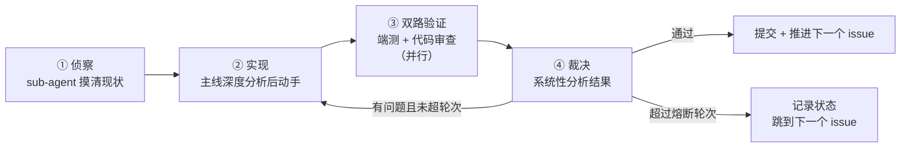

# Loop Engineering 推进方式

> Created: 2026-08-21
> Updated: 2026-08-21
> Status: active
>
> 本文定义本项目的开发推进机制：**以 issue 与 sub-issue 驱动的循环式长程开发**，支持无人值守执行。
>
> 架构约束见 [ADR-001](../designs/adr-001-tech-stack-and-architecture.md)。本文只管**怎么推进**，不重复架构决策。
>
> **2026-08-21 修订**：无人值守策略改为「不间断推进」。第 5 节熔断按依赖位置分级并新增依赖坍塌处置，第 6 节改为「自愈 → 绕过 → 继续」三步并给出终止条件，第 8 节把约束拆成硬约束（不可逆操作，永不执行）与软约束（绕过该任务，不中止运行）。可执行版本见 [night-run-prompt.md](./night-run-prompt.md)。

---

## 1. 为什么需要这套机制

项目需要在有限时间窗内（含无人值守时段）完成从零到可用 CLI 的建设。传统「人盯着 AI 一步步写」的方式受限于人的在场时间。

Loop Engineering 的核心是把开发拆成**可独立验收的循环单元**，每个循环自带验证与熔断，从而允许在无人值守时连续推进多个单元。

**这套机制成立的前提只有一条：每个 issue 都带机器可执行的验收标准。** 缺了它，验证阶段只能主观判断，循环会退化成「AI 觉得可以」或「AI 无限挑刺」两种失效模式。

---

## 2. 单个 Loop 的执行流程

一个 issue 对应一个 loop。四个阶段：



### 阶段 ① 侦察

派一个 sub-agent 读 issue、读相关代码与文档，回报：当前实际状态、涉及范围、已有可复用实现、issue 描述与代码现状的差异。

**目的是消除主线的盲区**。主线不要自己边写边摸——摸索过程会污染上下文，且容易在半路发现方向错误。

### 阶段 ② 实现

主线基于侦察结果做深度分析，然后实现。必须遵守 ADR-001 第 6 节的红线。

### 阶段 ③ 双路验证（并行派发）

| Sub-agent | 职责 | 判据 |
|---|---|---|
| **端到端测试** | 真实跑 issue 的验收命令，验证实际行为 | issue 的验收标准，逐条 |
| **代码审查** | 按 [code-review.md](../conventions/code-review.md) 与 ADR 红线审查 | 清单逐项 |

两者**必须并行派发**，且互相不知道对方结论——避免相互印证造成的盲区。

### 阶段 ④ 裁决

主线收到两份报告后做系统性分析，而不是无脑照做。判断每条意见属于：

- **真实缺陷** → 修（计入熔断轮次）
- **超出 issue 范围的改进建议** → 不修，记入 issue comment 或新建 issue（`code-review.md` 明确禁止超范围重构）
- **与 ADR 决策冲突的建议** → 不修，以 ADR 为准

---

## 3. Loop 序列：垂直切片优先

**排序原则**：先用最简实现打通完整链路，再逐层加厚。这样任何一个 loop 失败都不会导致「什么都跑不起来」。

| Loop | 内容 | 完成后的可用状态 |
|---|---|---|
| 1 | monorepo 骨架 + Docker Compose(PG) + 迁移工具 + 最小 schema | 容器能起、测试能跑 |
| 2 | `ingest file`（最简）+ `search`（全文）+ `get <id>` | **端到端通了，有可演示产物** |
| 3 | 飞书妙记 / 纪要接入（说话人 + 时间戳） | 真实会议语料进库 |
| 4 | 链接抓取 + 正文抽取 + 降级兜底 | 链接语料进库 |
| 5 | LLM 提炼 description / tags + 受控词表 | 渐进式披露成立 |
| 6 | TEI 容器 + pgvector + 混合检索 + **评测集** | 语义检索，且好坏可量化 |
| 7 | 重排 | 排序质量提升 |
| 8 | MCP server + `--json` 输出 | Cursor / Claude Code 可直接接入 |
| 9 | HTTP API | 团队远程模式与 Web 的前提 |

**依赖**：Loop 1 → 2 是硬串行。Loop 3 / 4 可并行。Loop 5 依赖 2。Loop 6 → 7 串行。Loop 8 / 9 依赖 2。

**Loop 2 是分水岭**：在它完成之前失败代价高（没有任何可用产物），之后每个 loop 失败只是「某项能力还没加厚」。因此 Loop 1-2 应优先保证质量，必要时占用更多时间窗。

---

## 4. 验收标准（DoD）规范

每个 issue 的验收标准**必须至少包含一条可执行命令及其期望结果**。

可接受的写法：

```
- [ ] `pnpm test` 全部通过
- [ ] `docker compose up -d` 后 `pnpm db:migrate` 成功，无报错退出
- [ ] `pnpm kb search "产品力"` 返回至少 1 条结果，且输出含 id 与 description 字段
- [ ] `pnpm typecheck` 无错误
```

不可接受的写法：

```
- [ ] 检索功能正常工作          ← 无法机械判断
- [ ] 代码质量良好              ← 主观
- [ ] 链接解析支持主流网站      ← 范围不可枚举
```

> 写 issue 时若发现某条验收标准无法表达成命令，说明该 issue 的范围没有定义清楚，应先拆分或收窄，而不是放宽标准。

---

## 5. 熔断规则

轮次上限**按 issue 在依赖图中的位置分级**，因为跳过的代价差异极大：

| 层级 | 修复轮次上限 | 理由 |
|---|---|---|
| **关键路径**（Loop 1-2 对应的 issue） | 4 轮 | 跳过一个会让后续多个 issue 连环报废，地基值得多试 |
| **加厚层**（Loop 3 及以后） | 2 轮 | 失败只意味着某项能力没加厚，不值得恋战 |

超过上限后：

1. 停止对该 issue 的修改
2. 把当前状态、失败原因、已尝试方案写进 issue comment
3. 打上 `blocked` 标签
4. 已有部分可用成果就提交；改动使链路变坏则 `git stash push -u` 存起来并记录 stash 名（**不用 `reset --hard`**，见第 8 节）
5. 跳到 DAG 中下一个无未满足依赖的 issue

### 依赖坍塌处置

关键路径 issue 被绕过时（例如容器起不来导致 schema 无法建立），**不等于本次执行结束**。改做不需要该依赖的部分：

| 挂掉的依赖 | 仍可推进的工作 |
|---|---|
| PostgreSQL | 正文抽取的纯函数与单测、LLM provider 抽象与接口测试、工程化完善（lint / CI / 测试脚手架） |
| Ollama | 除提炼与打标之外的一切 |
| TEI | 除向量灌入、混合检索、重排之外的一切 |

判断方式：该 issue 的验收命令中有多少条不依赖挂掉的组件。能做的部分做掉，做不了的记入 comment。

### 二次机会

任务列表走完一轮后若仍有时间，回头重试 `blocked` 的 issue，优先关键路径——环境可能已因其他 loop 的副作用而改变。重试最多一轮。

**每个 loop 完成后必须 commit 并 push。** 这样早上能从 GitHub 直接看到进度，也能单独回滚某一步。禁止把多个 loop 的产物堆成一个巨大提交。

---

## 6. 阻塞处置：自愈 → 绕过 → 继续

三步，按顺序。**无人值守时没有第四步「等人回复」**——停下等待等于整个时间窗停摆。需要人拍板的事写进 issue comment，然后按自己的判断继续。

### 6.1 第一步：自愈（安全动作白名单）

下列范围内可放手执行，无需请示：

- 改仓库内的任何代码、配置、测试、fixture
- 重启或重建容器（**不带 `-v`**）、改端口、改镜像 tag（GPU 起不来换 CPU）
- 装项目内依赖（`pnpm add`，写进 `package.json`）
- `ollama pull` 拉模型
- 新建文件、新建分支、commit、push 到工作分支
- 向前的数据库迁移（加表、加列、加索引）
- `gh issue comment` / `label`
- 用更笨但能跑通的实现替代复杂方案

边界很清晰：**改仓库内的东西可以，改机器上的东西不行。**

### 6.2 第二步：绕过（两种粒度）

- **绕过实现方式** —— 换个做法把 issue 的核心价值交付掉。例如正文抽取对某站点失效，记入失败队列并继续处理其他条目。收窄范围后交付优于整个 issue 报废。
- **绕过整个 issue** —— 打 `blocked` 标签，写清试过什么、卡在哪、需要人做什么，走下一个依赖已满足的 issue。

按类型对照：

| 类型 | 例子 | 处置 |
|---|---|---|
| **环境类** | 容器起不来、端口占用、模型下载失败、服务未启动 | 按 6.1 自愈。修不好则降级或绕过并记录 |
| **实现类** | 测试失败、类型错误、逻辑缺陷 | 在熔断轮次内修（第 5 节） |
| **范围类** | issue 描述与代码现状不符 | 收窄到能完成的部分交付，差异写进 comment。不擅自扩大范围 |
| **依赖类** | 前置 issue 未完成 | 绕过，走下一个依赖已满足的 issue；关键路径按第 5 节「依赖坍塌」拆解 |
| **外部依赖类** | 授权过期、站点反爬、网络超时 | 记录并绕过，不反复重试消耗时间窗 |
| **决策类** | 需要选新框架、改架构、改产品边界、引入 ADR 未涵盖的重要依赖 | **不自行拍板，也不停下等待。** 写进 issue comment，绕过该 issue，继续下一个 |

### 6.3 第三步：继续

绕过后立刻开始下一个 issue。不总结、不等待、不确认。

**两条心法**

- **降级优于阻塞**：能用笨办法先通链路就先通，在 comment 里标注「此处已降级」。
- **绕过不是失败**：一次绕过换来后续多个 loop 的推进，总产出更高。反复卡在一个 issue 上是最差结果。

### 6.4 终止条件

「不要停下」需要配一个明确的终点，否则会从「停摆」滑向另一个失效模式：**空转**——列表走完后自己发明任务，做出范围外的东西。

**唯一允许的正常结束**：全部 issue 到达终态（完成或 `blocked`），关键路径上被 blocked 的已重试过一轮，复盘已写完并提交。

**不构成结束理由**（遇到时继续跑）：单个 issue 卡住、不确定做法是否最优、想请示、觉得产出已经够多、剩余任务看起来都不好做。

**结束后不要继续找活**：不新增列表外的任务，不为了「还在跑」而做范围外的重构。

---

## 7. 每次启动前的前置检查

无人值守流程开始前逐项确认。**任何一项失败必须在开跑前由人修好**——第 8.1 节禁止 agent 改机器上的配置，它没有自救手段。Docker 守护进程尤其关键，它挂了整条关键路径都建不起来。

```powershell
docker info                      # Docker 守护进程在跑
docker compose ps                # 已有容器状态
ollama ps                        # Ollama 服务已启动（按需启动，必须显式确认）
ollama list                      # 目标模型已就绪
lark-cli auth status             # 飞书授权有效（refresh token 至 2026-08-26）
gh auth status                   # GitHub CLI 可用
git status --short               # 工作区干净
```

同时确认：Windows 电源设置不会休眠、Docker Desktop 不会自动更新重启。

---

## 8. 约束：硬约束与软约束

**这两类的处置方式完全不同，混淆会导致无人值守流程整晚停摆。**

早期版本把所有约束写成「违反就停下」，这是错的——「不选定 Web UI 框架」这类软约束根本不是危险操作，碰到它就中止运行是巨大的浪费。红线的正确语义是「这个动作永不执行」，而不是「碰到了就中止」。

### 8.1 硬约束：禁止不可逆的破坏性操作

判据：**该操作出错后能否靠 git 或重跑恢复？** 不能，即属禁止范围。清单不穷尽，遇到清单外的情况按判据推断。

| 类别 | 禁止动作 |
|---|---|
| **Git 历史** | force push（任何形式与分支）；对已推送提交 rebase / amend；`git reset --hard`；`git clean -fd`；删除分支；直接推 `main` |
| **文件系统** | 删除或移动非本次新建的文件与目录；覆盖 `.env` 或已有配置的原有内容；操作仓库目录之外的文件 |
| **数据与容器** | `docker compose down -v`；`docker volume rm`；`docker system prune`；对已有数据 `DROP` / `TRUNCATE`；删除 `pgdata`、`.ollama`、模型缓存 |
| **系统与全局** | 全局装卸软件；改 PATH 或系统环境变量；改 git 全局 config；卸载重装 Docker / Ollama / Node；操作其他项目目录 |
| **远程协作** | 删除 issue 或 PR（完成用 close）；改仓库设置或可见性；合并任何东西进 `main` |
| **不可逆泄露** | 提交密钥、`.env`、真实语料、大于 25 MB 的文件——推送后进入历史，无法真正撤回 |

**需要回滚时**用 `git stash push -u` 并记录 stash 名，不用 `reset --hard`。stash 可恢复，reset 不可。

### 8.2 软约束：遇到就绕过该任务，不中止运行

以下情况说明**这个任务今晚做不了**，处置是打 `blocked` 标签、记录、走下一个 issue：

1. 只能靠改 ADR-001 的决策才能完成 → 记录理由，不要改文档再照新决策实现
2. 只能靠入库聊天发言原文才能完成（ADR-001 §8，官方 API 也不行）
3. 只能靠新增 ADR 未规划的顶层目录才能完成
4. 只能靠 ignore / skip 糊过 `typecheck` / `test` 才能「通过」——糊过去等于交付假成果，比跳过更糟
5. 只能靠实现聊天记录破解或非官方导出才能完成
6. 需要选定 Web UI 框架或部署平台（仍未决策）

---

## 9. 与 issue 体系的关系

- Epic（parent issue）对应一个 Loop 或一组紧密相关的 Loop
- sub-issue 是**一个 loop 内可完成**的工作单元
- 创建 issue 必须走 `AGENTS.md` 规定的 skill，不自行发挥流程
- issue 是问题空间，不写实现方案；实现约束一律引用 ADR-001

---

## 10. 复盘

每次长程执行结束后，在 `docs/updates/` 记录：完成了哪些 loop、哪些被跳过及原因、哪些决策需要人工介入、机制本身需要什么调整。

机制本身也是可迭代的——如果熔断轮次、阻塞矩阵在实践中不合适，改本文并注明日期。
