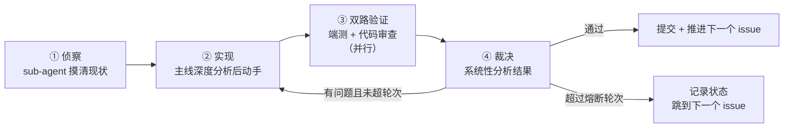

# Loop Engineering 推进方式

> Created: 2026-08-21
> Updated: 2026-08-21
> Status: active
>
> 本文定义本项目的开发推进机制：**以 issue 与 sub-issue 驱动的循环式长程开发**，支持无人值守执行。
>
> 架构约束见 [ADR-001](../designs/adr-001-tech-stack-and-architecture.md)。本文只管**怎么推进**，不重复架构决策。

---

## 1. 为什么需要这套机制

项目需要在有限时间窗内（含无人值守时段）完成从零到可用 CLI 的建设。传统「人盯着 AI 一步步写」的方式受限于人的在场时间。

Loop Engineering 的核心是把开发拆成**可独立验收的循环单元**，每个循环自带验证与熔断，从而允许在无人值守时连续推进多个单元。

**这套机制成立的前提只有一条：每个 issue 都带机器可执行的验收标准。** 缺了它，验证阶段只能主观判断，循环会退化成「AI 觉得可以」或「AI 无限挑刺」两种失效模式。

---

## 2. 单个 Loop 的执行流程

一个 issue 对应一个 loop。四个阶段：



### 阶段 ① 侦察

派一个 sub-agent 读 issue、读相关代码与文档，回报：当前实际状态、涉及范围、已有可复用实现、issue 描述与代码现状的差异。

**目的是消除主线的盲区**。主线不要自己边写边摸——摸索过程会污染上下文，且容易在半路发现方向错误。

### 阶段 ② 实现

主线基于侦察结果做深度分析，然后实现。必须遵守 ADR-001 第 6 节的红线。

### 阶段 ③ 双路验证（并行派发）

| Sub-agent | 职责 | 判据 |
|---|---|---|
| **端到端测试** | 真实跑 issue 的验收命令，验证实际行为 | issue 的验收标准，逐条 |
| **代码审查** | 按 [code-review.md](../conventions/code-review.md) 与 ADR 红线审查 | 清单逐项 |

两者**必须并行派发**，且互相不知道对方结论——避免相互印证造成的盲区。

### 阶段 ④ 裁决

主线收到两份报告后做系统性分析，而不是无脑照做。判断每条意见属于：

- **真实缺陷** → 修（计入熔断轮次）
- **超出 issue 范围的改进建议** → 不修，记入 issue comment 或新建 issue（`code-review.md` 明确禁止超范围重构）
- **与 ADR 决策冲突的建议** → 不修，以 ADR 为准

---

## 3. Loop 序列：垂直切片优先

**排序原则**：先用最简实现打通完整链路，再逐层加厚。这样任何一个 loop 失败都不会导致「什么都跑不起来」。

| Loop | 内容 | 完成后的可用状态 |
|---|---|---|
| 1 | monorepo 骨架 + Docker Compose(PG) + 迁移工具 + 最小 schema | 容器能起、测试能跑 |
| 2 | `ingest file`（最简）+ `search`（全文）+ `get <id>` | **端到端通了，有可演示产物** |
| 3 | 飞书妙记 / 纪要接入（说话人 + 时间戳） | 真实会议语料进库 |
| 4 | 链接抓取 + 正文抽取 + 降级兜底 | 链接语料进库 |
| 5 | LLM 提炼 description / tags + 受控词表 | 渐进式披露成立 |
| 6 | TEI 容器 + pgvector + 混合检索 + **评测集** | 语义检索，且好坏可量化 |
| 7 | 重排 | 排序质量提升 |
| 8 | MCP server + `--json` 输出 | Cursor / Claude Code 可直接接入 |
| 9 | HTTP API | 团队远程模式与 Web 的前提 |

**依赖**：Loop 1 → 2 是硬串行。Loop 3 / 4 可并行。Loop 5 依赖 2。Loop 6 → 7 串行。Loop 8 / 9 依赖 2。

**Loop 2 是分水岭**：在它完成之前失败代价高（没有任何可用产物），之后每个 loop 失败只是「某项能力还没加厚」。因此 Loop 1-2 应优先保证质量，必要时占用更多时间窗。

---

## 4. 验收标准（DoD）规范

每个 issue 的验收标准**必须至少包含一条可执行命令及其期望结果**。

可接受的写法：

```
- [ ] `pnpm test` 全部通过
- [ ] `docker compose up -d` 后 `pnpm db:migrate` 成功，无报错退出
- [ ] `pnpm kb search "产品力"` 返回至少 1 条结果，且输出含 id 与 description 字段
- [ ] `pnpm typecheck` 无错误
```

不可接受的写法：

```
- [ ] 检索功能正常工作          ← 无法机械判断
- [ ] 代码质量良好              ← 主观
- [ ] 链接解析支持主流网站      ← 范围不可枚举
```

> 写 issue 时若发现某条验收标准无法表达成命令，说明该 issue 的范围没有定义清楚，应先拆分或收窄，而不是放宽标准。

---

## 5. 熔断规则

**单个 issue 最多 2 轮修复。** 第 2 轮后若验证仍不通过：

1. 停止对该 issue 的修改
2. 把当前状态、失败原因、已尝试方案写进 issue comment
3. 给 issue 打上 `blocked` 标签
4. 若已有部分可用成果，提交它；若改动使链路变坏，回滚到该 loop 开始前的状态
5. 跳到 DAG 中下一个无未满足依赖的 issue

**每个 loop 完成后必须 commit。** 这样早上能看到每一步的痕迹，也能单独回滚某一步。禁止把多个 loop 的产物堆成一个巨大提交。

---

## 6. 阻塞处置矩阵

遇到阻塞时**自主判断处置方式**，按类型对照下表。原则是：**技术问题可以自己想办法，决策问题一律不许自己拍。**

| 类型 | 例子 | 处置 |
|---|---|---|
| **环境类** | 容器起不来、端口占用、模型下载失败、Ollama 未启动 | **自行尝试修复**。有明确修复路径就修（改端口、重启服务、换 CPU 镜像）。修不好则降级或跳过，并记录 |
| **外部依赖类** | 飞书 token 过期、目标网站反爬、网络超时 | **记录并跳过**，不要反复重试消耗时间窗。把失败项写入 issue comment，标注需要人工介入 |
| **实现类** | 测试失败、类型错误、逻辑缺陷 | **在熔断轮次内修复**。超限则按第 5 节处理 |
| **依赖类** | 前置 issue 未完成 | **跳过**，走 DAG 中下一个无未满足依赖的 issue |
| **范围类** | 发现 issue 描述与代码现状不符、范围需要调整 | **收窄到能完成的部分**并交付，把差异写进 issue comment。不要擅自扩大范围 |
| **决策类** | 需要选新框架、改架构、改产品边界、引入 ADR 未涵盖的重要依赖 | **绝不自行决定。** 记录到 issue 并跳过该 issue。这是 `AGENTS.md` 的硬规则 |

**降级优于阻塞**：能用更笨的实现先通链路，就先通。例如 TEI GPU 镜像起不来就用 CPU 镜像；正文抽取对某站点失效就记录失败并继续处理其他条目。

**跳过不是失败**：一次跳过换来后续多个 loop 的推进，总产出更高。反复卡在一个 issue 上是最差结果。

---

## 7. 每次启动前的前置检查

无人值守流程开始前逐项确认，任何一项失败先修再跑：

```powershell
docker info                      # Docker 守护进程在跑
docker compose ps                # 已有容器状态
ollama ps                        # Ollama 服务已启动（按需启动，必须显式确认）
ollama list                      # 目标模型已就绪
lark-cli auth status             # 飞书授权有效（refresh token 至 2026-08-26）
gh auth status                   # GitHub CLI 可用
git status --short               # 工作区干净
```

同时确认：Windows 电源设置不会休眠、Docker Desktop 不会自动更新重启。

---

## 8. 安全红线（无人值守时同等生效）

违反以下任一条，立即停止而不是绕过：

1. **不 force push**，不推 `main` 以外的破坏性操作
2. **不改 ADR-001 的决策**。发现决策有问题就记录，不要自己改文档再照新决策实现
3. **不入库任何人的聊天发言原文**（ADR-001 §8）
4. **不提交密钥、`.env`、真实语料、大于 25 MB 的文件**
5. **不删除文件、不新增 ADR 未规划的顶层目录**
6. **不跳过已约定的检查**（`pnpm test` / `typecheck` 不许用忽略规则糊过去）
7. **不实现聊天记录的破解或非官方导出**

---

## 9. 与 issue 体系的关系

- Epic（parent issue）对应一个 Loop 或一组紧密相关的 Loop
- sub-issue 是**一个 loop 内可完成**的工作单元
- 创建 issue 必须走 `AGENTS.md` 规定的 skill，不自行发挥流程
- issue 是问题空间，不写实现方案；实现约束一律引用 ADR-001

---

## 10. 复盘

每次长程执行结束后，在 `docs/updates/` 记录：完成了哪些 loop、哪些被跳过及原因、哪些决策需要人工介入、机制本身需要什么调整。

机制本身也是可迭代的——如果熔断轮次、阻塞矩阵在实践中不合适，改本文并注明日期。
